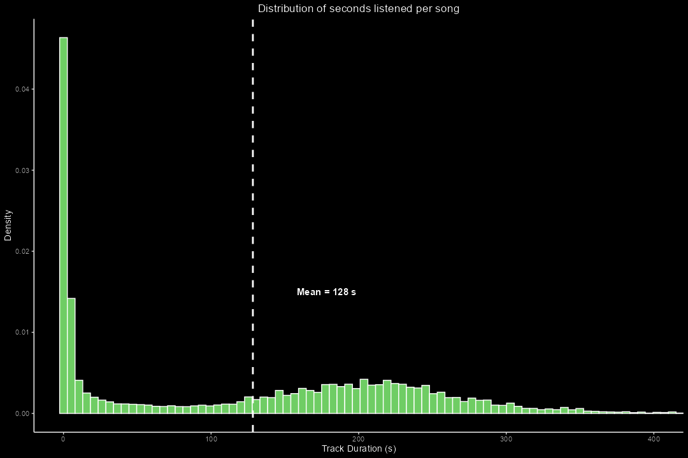
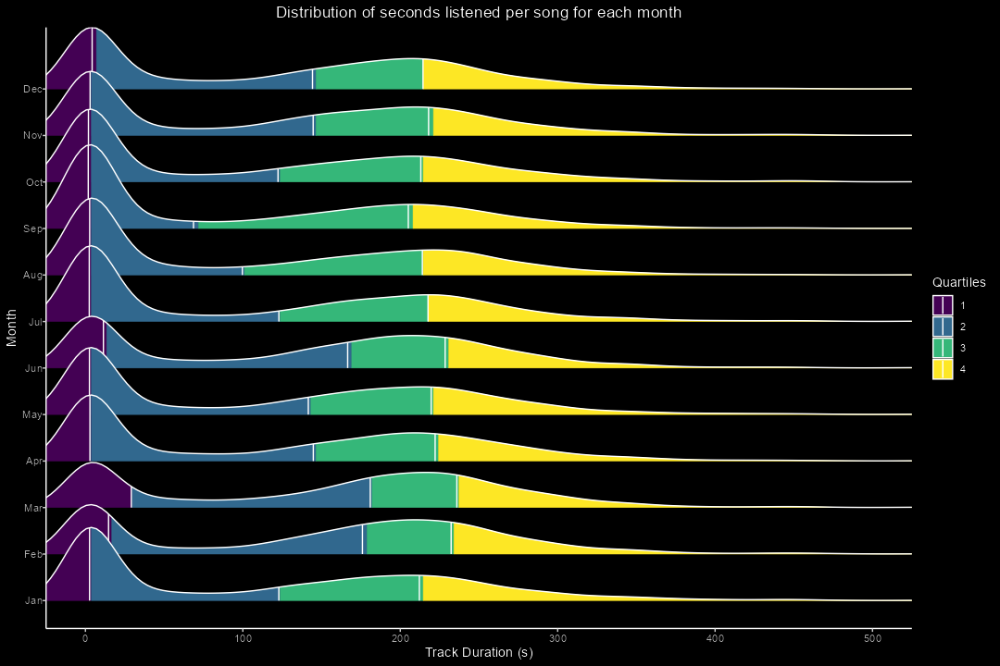
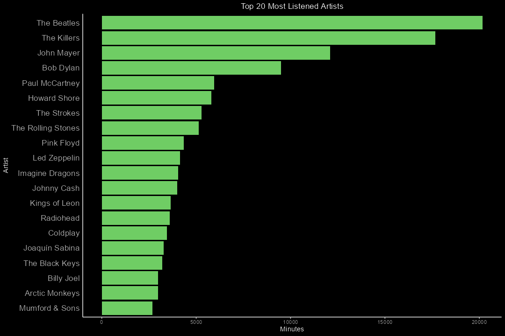
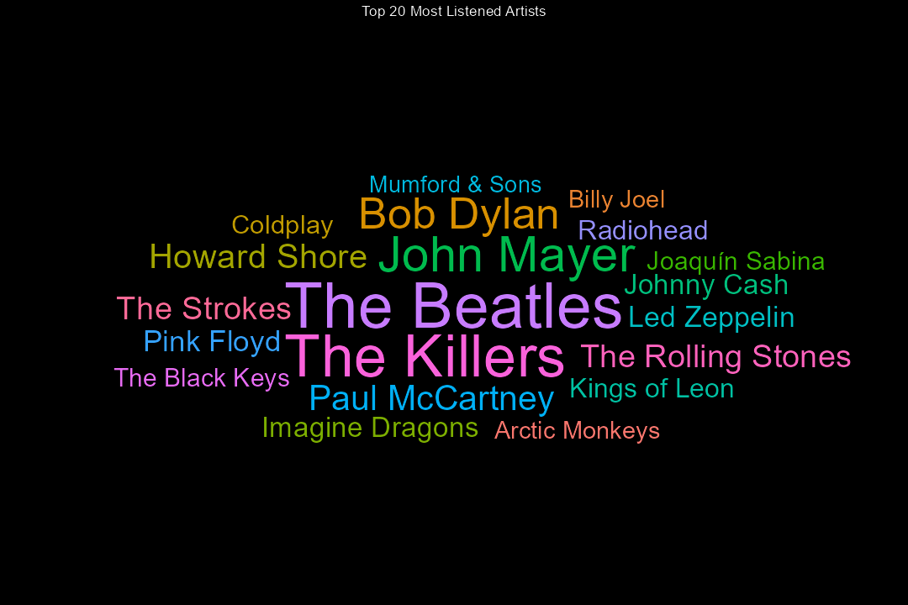
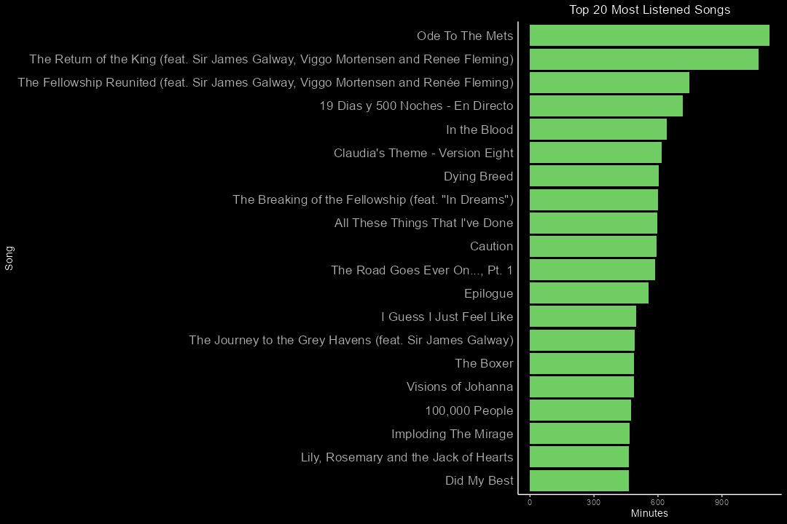
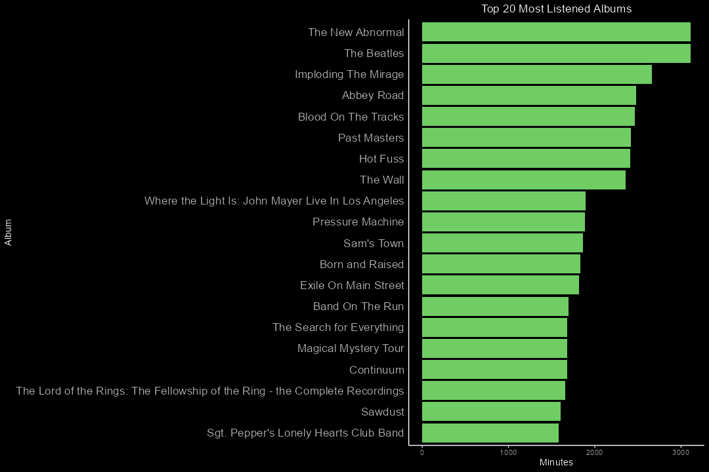
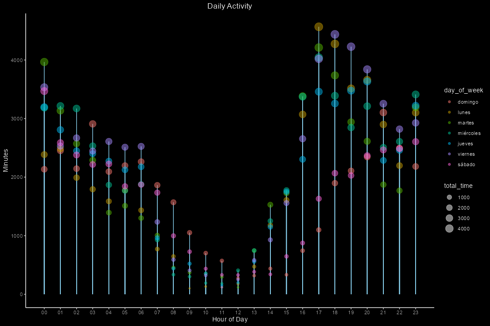
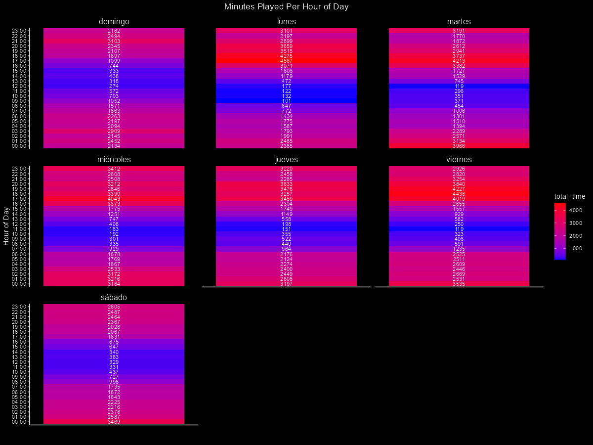
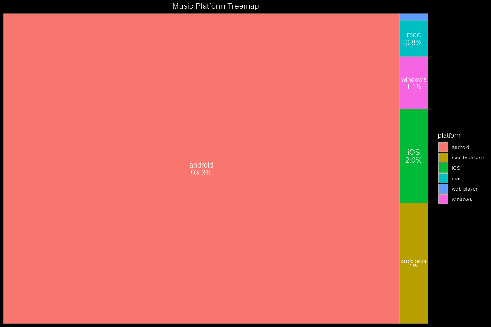
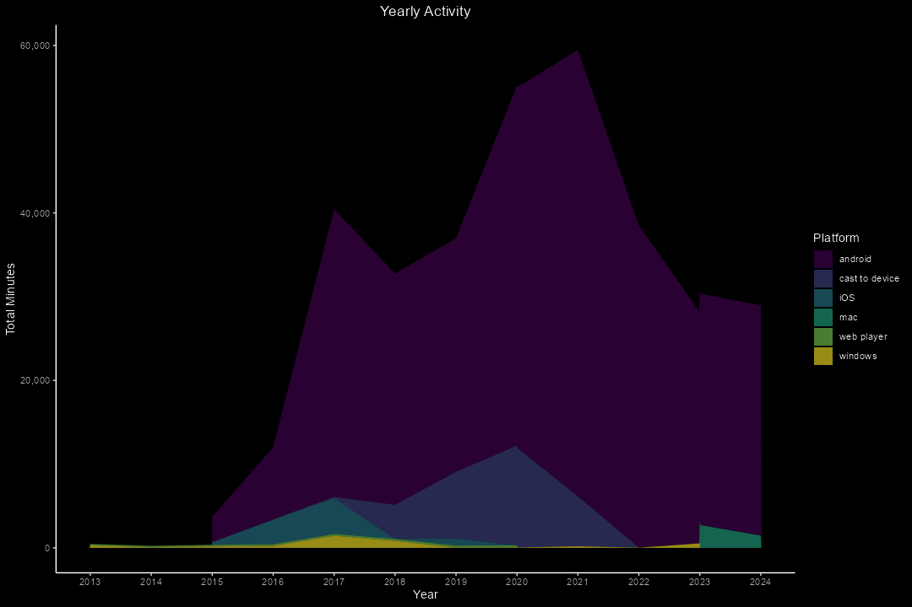

# Introduction

This is a visualization project for the [Mavens Music Challenge](https://mavenanalytics.io/challenges/maven-music-challenge/e161353d-9967-4297-869c-505de168e610). Every December, millions of Spotify users look forward to their Spotify Wrapped – a personalized recap showcasing their listening habits over the past year 🎧. Spotify user's complete music streaming history data can be downloaded [here](https://maven-datasets.s3.us-east-1.amazonaws.com/Spotify+Streaming+History/Spotify+Streaming+History.zip).


# Tools I used
For this visualization project I wanted to harness the power of [ggplot2](https://ggplot2.tidyverse.org/), one of my favorite visualization libraries due to its flexibility and customization capabilities. I also used [dplyr](https://dplyr.tidyverse.org/) for data manipulation.

# Analysis
The first step in our data analysis process is to transform the dataframe provided in the CSV file to ensure it is tidy and well-structured. To achieve this, we use the pipe operator (**%>%**), which allows us to streamline a series of transformations to obtain a dataframe that is ready for analysis.

```R
spotify <- df %>%  mutate(
  ts = ymd_hms(ts),
  hour = hour(ts), 
  date = as.Date(ts), 
  seconds = ms_played / 1000       
) %>%
  mutate(
    year = year(date), 
    month_num = month(date), 
    day = day(date), 
    day_of_week = wday(date, label = TRUE, abbr = FALSE) 
  ) %>%
  mutate(
    month = month.abb[month_num]
  ) %>%
  select(
    platform,
    hour,
    track_name,
    artist_name,
    seconds,
    album_name,
    year,
    month,
    day,
    day_of_week
  ) 
```
I wanted to answer the following questions about our dataset.
- What is the distribution of track duration, taking into account that the user might not listen to the entire song but rather to a small excerpt? Does it follows the same pattern every month?
- What are the most listened artists, albums and songs?
- How does the listening pattern changes during an entire week?
- What is the preferred platform?
- How listening habits have changed over the years? 

## Distribution of track duration


As we can observe the distribution exhibits a moderately positive skewness (the median is greater than the mean), this implies that most tracks have a short duration, while a smaller number of long tracks stretch out towards the right. This pattern is consistent accross months as shown in the ridgeplot below.



## Top Artists, Songs and Albums
 One of the most exciting things about Spotify Wrapped is that you can uncover musical taste by extracting bands 🧑‍🎤, songs 𝄞 and albums 📀. Let's see the top 20.

### Top Artists



This person really likes rock and blues 🎸.
### Top Songs 


### Top Albums


## Daily Activity
We can analyze daily listening habits to identify the hours and days of the week when music is most frequently played.




There is a clear pattern of nighttime music listening, peaking between 5:00 PM and 8:00 PM, especially on Mondays and Fridays.   
## Preferred Platform

What about the preferred platform?  

In this case, Android has beaten its competitors in an overwhelming manner.
## Playback Activity over the years
How the playback activity has evolved over the years?


Playback activity peaked in two years: first in 2017 and most notably in 2021, likely influenced by the Covid-19 lockdown.
# Conclusions
- Consistent Prevalence of Short Track Durations: This trend remains steady across all months.
- Preference for Blues and Rock Genres: These styles dominate listener choices.
- Nighttime Listening Patterns: Music consumption peaks on Mondays and Fridays.
- Preference for Android Platforms: Users favor Android devices for playback.
- Playback Activity Trends: Notable peaks in activity occurred in 2017 and significantly in 2021.
